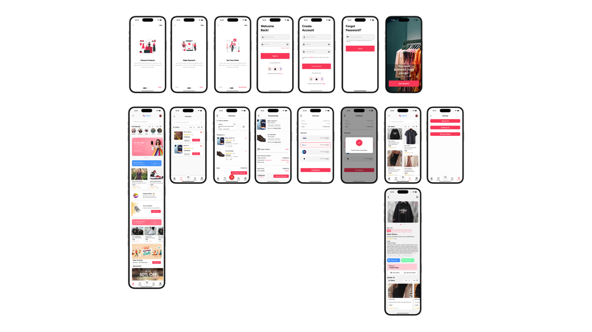

# 📱 E-Commerce Mobile App

A beautifully designed cross-platform **e-commerce mobile application** built with React Native. This app allows users to browse products, add them to a wishlist or cart, and complete purchases with a clean and modern user experience.

---

## 🚀 Features

- 🛍️ Product listing with category filter and sort options  
- 🔍 Smart product search  
- ❤️ Add/remove favorites (wishlist)  
- 🛒 Add to cart, update quantities, remove items  
- 📦 Product detail page with image slider, size selector, and description  
- 🔐 Authentication via Google, Facebook, and Apple  
- 💳 Checkout page with order summary and confirmation modal  
- 🧠 Local data persistence using AsyncStorage (cart & favorites)  
- 🎨 Clean, responsive UI for both iOS and Android  

---

## 🧱 Built With

- React Native (CLI)
- TypeScript
- React Navigation
- AsyncStorage
- Firebase Authentication
- Formik & Yup (for forms and validation)
- Custom reusable components (Image Slider, Star Rating, Size Buttons)
- Modular, scalable folder structure

---

## 📦 Installation

```bash
git clone https://github.com/yourusername/ecommerce-app.git
cd ecommerce-app
npm install
npx pod-install # only for iOS
npx react-native run-android # or run-ios for iOS
```

---

## 📸 Screenshots


---

## ✨ Contributions

Pull requests are welcome! For major changes, please open an issue first to discuss what you would like to change.  
Suggestions, feedback, and improvements are appreciated.

---

## 📄 License

This project is licensed under the MIT License. See the [LICENSE](./LICENSE) file for details.
